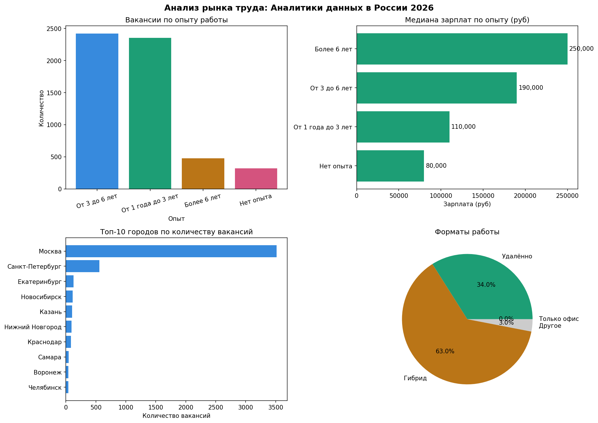

# hh-job-market-analysis
Analysis of Data Analyst job market in Russia 2026 using hh.ru API
# 📊 Анализ рынка труда: Аналитики данных в России 2026

## 📌 О проекте
Исследование рынка вакансий для аналитиков данных в России.  
Данные собраны через **hh.ru API** в реальном времени — июнь 2026.  
5 573 уникальных вакансии по 173 городам России.

## 🎯 Исследовательские вопросы
- Где сосредоточен рынок аналитиков данных в России?
- Каков реальный входной барьер для junior специалистов?
- Сколько платят на разных уровнях опыта?
- Какова доля удалённой работы?

## 🔍 Ключевые выводы
- 🏙️ **Москва доминирует** — 63% всех вакансий сосредоточено в столице
- 🚪 **Высокий входной барьер** — только 5.8% вакансий доступны junior без опыта
- 💻 **Удалёнка** — 27.7% вакансий предлагают удалённый формат
- 💰 **Зарплаты:** Junior 80к → Middle 110к → Senior 190к → Lead 250к руб/мес
- 📊 **Прозрачность:** лишь 31% работодателей указывают зарплату
- 📍 **Краснодар:** 84 вакансии, из них 20 удалённых

## 🛠️ Технологии
| Инструмент | Применение |
|---|---|
| Python | Сбор и анализ данных |
| requests | Работа с hh.ru API |
| pandas | Обработка и очистка данных |
| matplotlib | Визуализация |
| Jupyter Notebook | Среда разработки |

## 📁 Структура репозитория
- `hh_vacancy_analysis.ipynb` — основной ноутбук с анализом
- `hh_vacancies_clean.csv` — очищенный датасет (5 573 вакансии)
- `hh_analysis.png` — визуализация ключевых метрик
- `summary.txt` — текстовые выводы исследования

## 📈 Визуализация

## 🔗 Источник данных
[hh.ru API](https://dev.hh.ru) — открытый API крупнейшего российского job-сайта

## 👤 Автор
Вячеслав Гебель — BI / Data Analyst  
📧 gebel@internet.ru | Telegram: @gebel_slava  
🔗 [GitHub портфолио](https://github.com/gebelslavat-dotcom)
