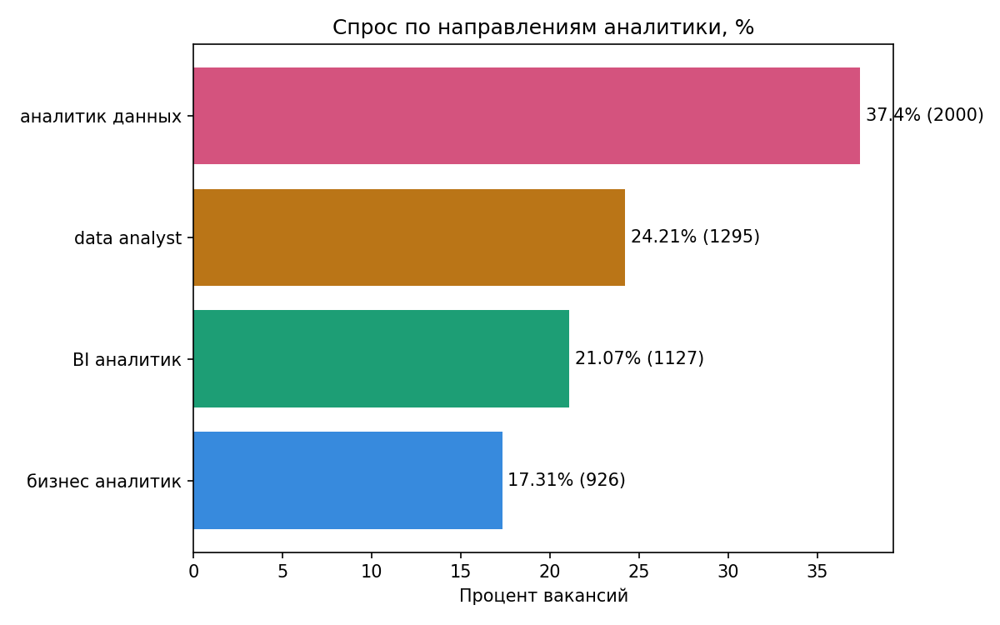
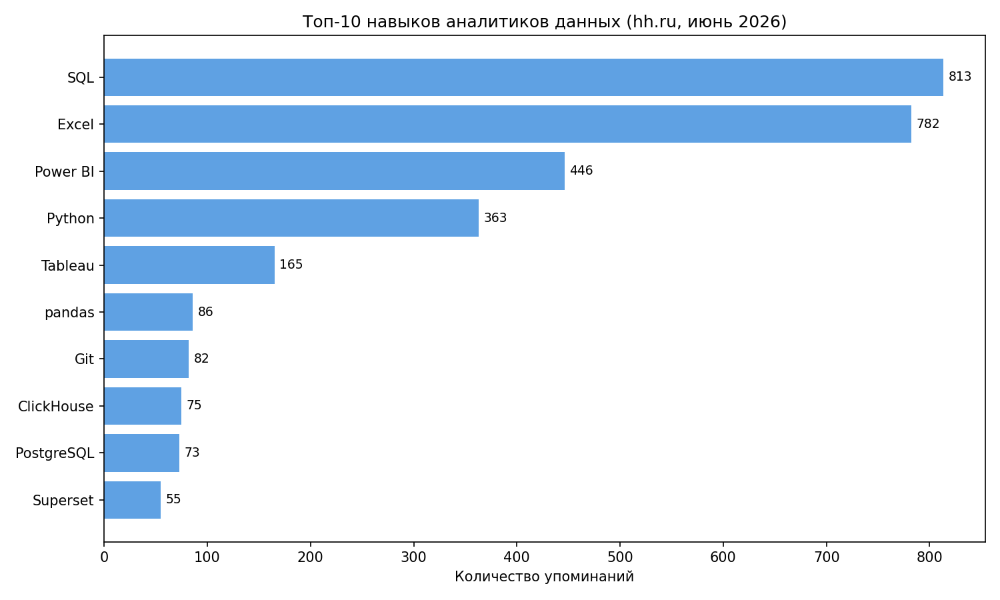
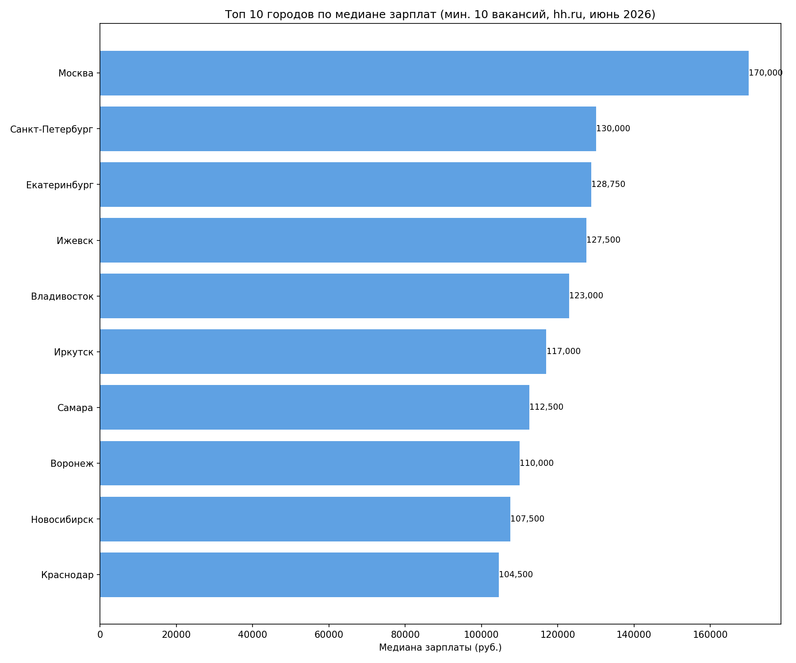
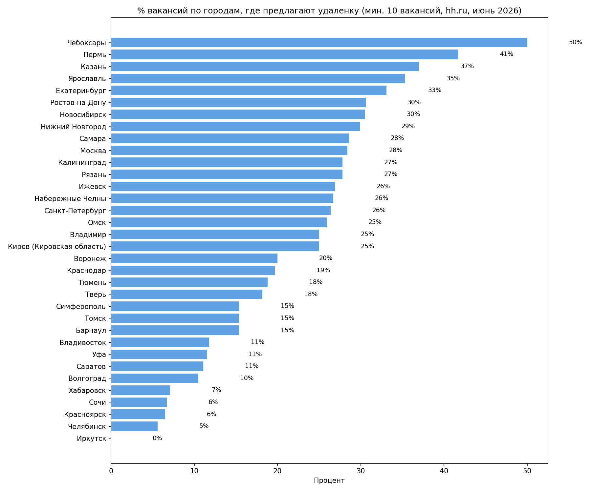
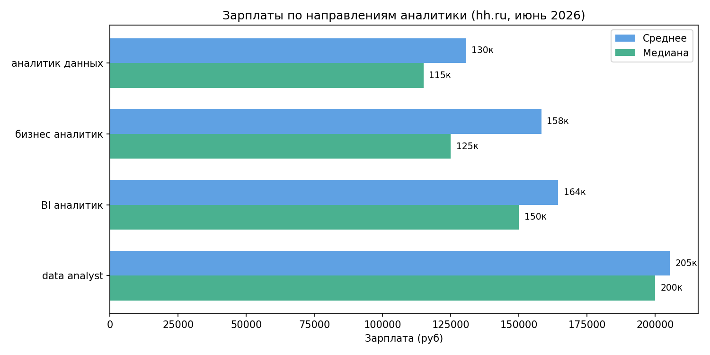
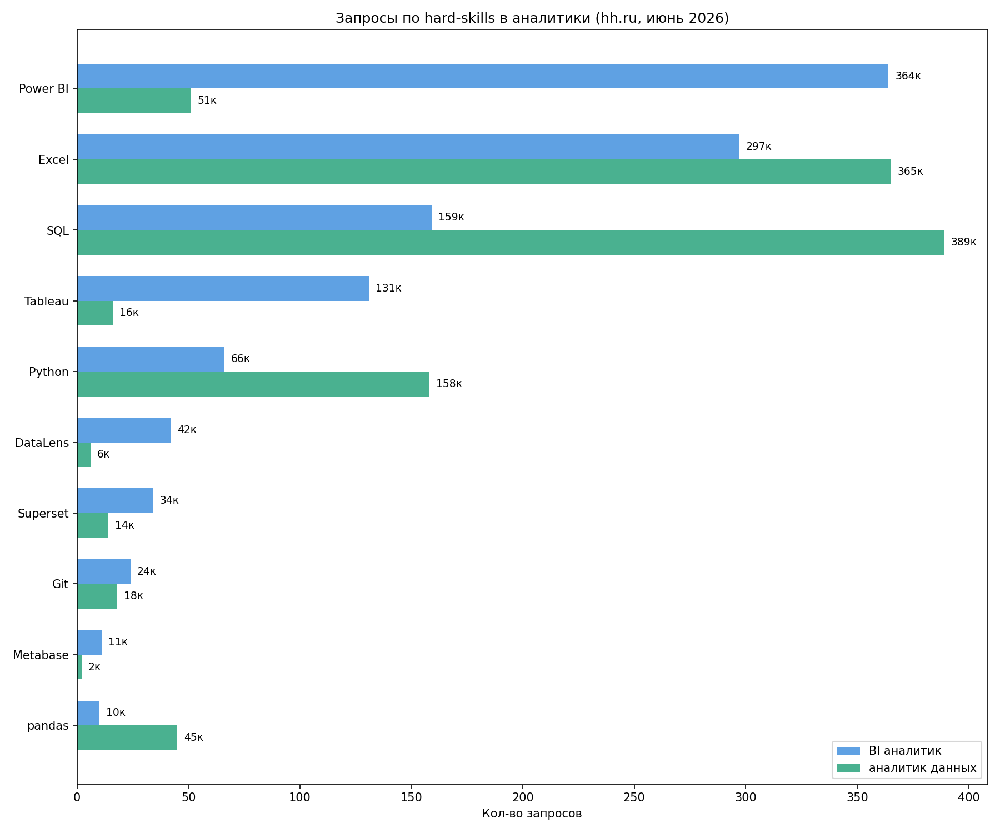
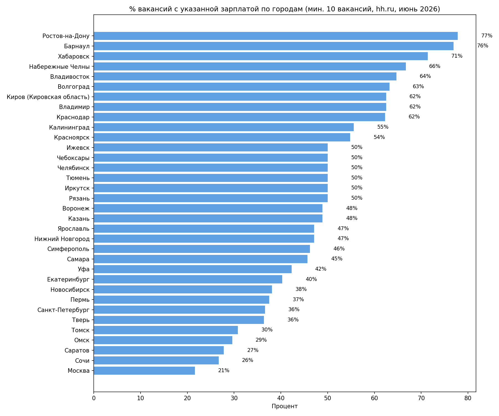

# hh-job-market-analysis
Analysis of Data Analyst job market in Russia 2026 using hh.ru API
# 📊 Анализ рынка труда: Аналитики данных в России 2026

## 📌 О проекте

Исследование рынка вакансий для аналитиков данных в России.
Данные собраны через hh.ru API — июнь 2026.

- **5 348** уникальных вакансий по **173 городам** России
- Поисковые запросы: аналитик данных, data analyst, BI аналитик, бизнес аналитик
- Анализ спроса, зарплат, навыков, географии и удалённой работы

## 🎯 Исследовательские вопросы

- Which direction has the most demand? — Какое направление самое востребованное?
- Which category pays the most? — Какое направление платит больше?
- How does salary vary by experience? — Как зарплата меняется по опыту?
- What skills are most in demand? — Какие навыки самые востребованные?
- What % of vacancies show salary? — Какой % вакансий указывает зарплату?
- Which cities have the highest salaries? — Какие города платят больше?
- Which cities offer the most remote jobs? — Какие города дают удалёнку?
- How competitive is Krasnodar market? — Насколько конкурентен рынок Краснодара?

## 🔍 Ключевые выводы

### 📊 Спрос
- «Аналитик данных» — самое популярное направление (37%), но самая низкая зарплата
- «Data analyst» — меньше вакансий (24%), но платят больше всех

### 💰 Зарплаты
- Разброс огромный: Москва 170к vs Саратов 70к
- Data analyst: junior 145к → senior 350к (x2.4)
- Только 31% вакансий указывают зарплату

### 🛠️ Навыки
- Топ-3: SQL, Excel, Power BI — базовый минимум
- Python выделяет среди конкурентов

### 🌍 География
- Москва 63% всех вакансий
- Регионы прозрачнее: Ростов 78%, Краснодар 62% указывают зарплату
- Удалёнка выше в регионах: Чебоксары 50%, Пермь 42%

### 📍 Краснодар
- 61 вакансия, медиана 104.5к
- 62.3% вакансий с указанной зарплатой — выше среднего
- Удалёнка 19% — рынок офисный

## 🛠️ Технологии
| Инструмент | Применение |
|---|---|
| Python | Сбор и анализ данных |
| requests | Работа с hh.ru API |
| pandas | Обработка и очистка данных |
| matplotlib | Визуализация |
| Jupyter Notebook | Среда разработки |

## 📁 Структура репозитория

| Файл | Описание |
|---|---|
| `hh_vacancy_analysis_st.ipynb` | основной ноутбук с анализом |
| `hh_vacancies_v2.csv` | рабочий датасет (5348 вакансий) |
| `category_demand.png` | спрос по направлениям |
| `salary_by_category.png` | зарплаты по категориям |
| `skills_top10.png` | топ-10 навыков |
| `compare_df.png` | сравнение навыков BI vs DA |
| `salary_pct_city.png` | % вакансий с зарплатой по городам |
| `salary_m_by_city.png` | медиана зарплат по городам |
| `remote_pct_city.png` | % удалёнки по городам |

## 📈 Визуализация

### Спрос по направлениям

### Топ-10 навыков

### Медиана зарплат по городам

### % удалёнки по городам

## 🔗 Источник данных
[hh.ru API](https://dev.hh.ru) — открытый API крупнейшего российского job-сайта

### Зарплаты по категориям

### Сравнение навыков BI vs Data Analyst

### % вакансий с указанной зарплатой по городам

## 👤 Автор
Вячеслав Гебель — BI / Data Analyst  
📧 gebel@internet.ru | Telegram: @gebel_slava  
🔗 [GitHub портфолио](https://github.com/gebelslavat-dotcom)
